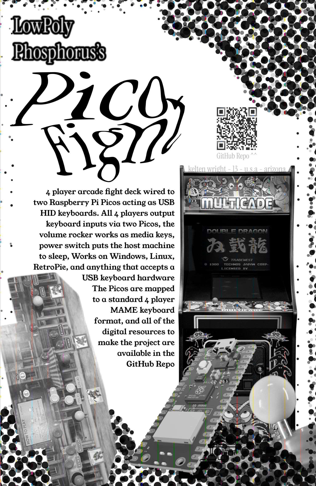

# fightdeck
4 player TMNT arcade fight deck wired to two Raspberry Pi Picos acting as USB HID keyboards. Built for Fallout Fest as a hackathon project.

## what it does
- all 4 players output keyboard inputs via two Picos
- volume rocker works as media keys
- power switch puts the host machine to sleep
- works on Windows, Linux, RetroPie, and anything that accepts a USB keyboard

## hardware
- 2x Raspberry Pi Pico
- TMNT Arcade1Up 4 Player fight deck
- micro usb cables (optional a usb hub to make it only take up one cable and have a cleaner interface)
   
 if you want to make this yourself, you can do it with just 2 players too!, just take the firmware from pico 1 or pico 2 if you have power and volume buttons (but you may have to remap the buttons) 
| Item                   | Qty | Price  | Link                                                                                                                                                                                                                                                                                                                                                                                                                                                                                                                   |
|------------------------|-----|--------|------------------------------------------------------------------------------------------------------------------------------------------------------------------------------------------------------------------------------------------------------------------------------------------------------------------------------------------------------------------------------------------------------------------------------------------------------------------------------------------------------------------------|
| Raspberry Pi Pico 2Pcs | 1   | $14.59 | https://www.amazon.com/Raspberry-Pi-Pico-Development-Integrated/dp/B0BDLHMQ9C/ref=sr_1_1?crid=3HLWCUB48HJ6X&dib=eyJ2IjoiMSJ9.2DgeplSReQxI3NoQG6DUBY9gCzgNllj2yiY8xBkx7JMUW34yh80x4xR3CZBE6yy7_tfyFfoWvmv5LxD4Idl6edUHHHTypvZap_TRUiyagGDAPBkbTYhsvzghc44gBgz8nf_i8EKRk3WjwharvKg3JgiyaTJwb0WdTJA3mkxNaBacYhptYSXQ-wlJVcTdS_jWnH4rPa7dB2wt2VkpEqIX5YYyUi2vKhqHtteAGgnpBDA.aYwY7rWr27JXQH3ualWLxUriI3v4tz81XT691Xubr2g&dib_tag=se&keywords=raspberry+pi+pico&qid=1781469011&sprefix=raspberry+pi+pico%2Caps%2C207&sr=8-1 |

## pico layout 
- Pico 1: P1 + P2
- Pico 2: P3 + P4

## key mapping
standard MAME 4 player keyboard layout
| | Up | Down | Left | Right | Button 1 | Button 2 | Button 3 |
|-|----|----|----|----|----|----|-----|
| P1 | Up Arrow | Down Arrow | Left Arrow | Right Arrow | L-Ctrl | L-Alt | Space |
| P2 | R | F | D | G | A | S | Q |
| P3 | I | K | J | L | R-Shift | Enter | P |
| P4 | Num 8 | Num 2 | Num 4 | Num 6 | Num 0 | Num . | Num Enter |

## flashing 
1. hold BOOTSEL and plug in the pico
2. drag the CircuitPython UF2 onto RPI-RP2
3. copy the adafruit_hid folder into /lib/
4. drop boot.py and code.py onto the root of the device

## NES emulator tool
includes a browser based NES emulator page for demo purposes using EmulatorJS
 
1. put fightdeck-nes.html and your .nes ROM file in the same folder
2. open a terminal in that folder and run `python -m http.server 8080`
3. open `http://localhost:8080/fightdeck-nes.html` in your browser
4. type the ROM filename into the box and hit Launch
5. configure controls inside the emulator settings menu
note: you have to use the localhost URL, opening the HTML file directly will not work

# Zine

# Gallery 

> Some of these photos are older and were taken before it was finished, the final build has the picos fully soldered
